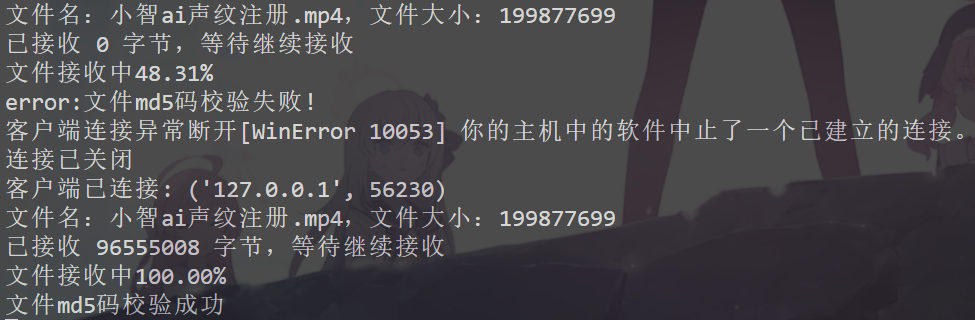

![Note]
本项目计划实现TCP协议的断点续传和在线播放功能。项目灵感来源于[github项目](https://example.com)。

1. 断点续传：

2. 在线播放：

记录项目开发过程：
- 使用struct.pack对数据头进行打包，'128sl'代表128字节的字符串和一个长整型（文件名和文件大小）
- 服务器判断文件是否传输完全是靠接收的数据大小的文件总大小是否相等，如果使用断点续传时需要注意接收的数据大小要加上断点的大小。
- 报错'utf-8' codec can't decode byte 0x86 in position 4: invalid start byte
  - 现象：使用ctrl+C强行关闭客户端时，服务器会报错并且接收数据有误
  - 解决方案：接收断点位置时，只接受了前八位。导致客户端数据传多了，而服务器在接收完文件数据后需要接收文件头或者断点位置，导致解析方式出问题。
  - 上述问题比较严重，实际使用必须改变数据接收和传送方式，目前必须保证客户端和服务端发送接收格式完全一致才行。
