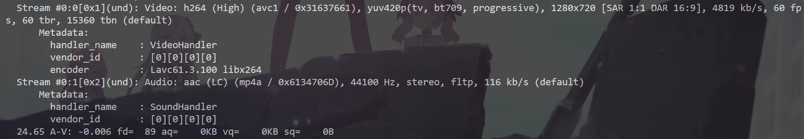

TCP
===============

> [!Note]
> 本项目计划实现TCP协议的断点续传和在线播放功能。项目灵感来源于[github项目](https://github.com/sun1638650145/transTool)。

**项目展示**

1. 断点续传：传输过程中主动结束、下一次传输会进行断点续传。

1. 在线播放：接收方无需下载文件，直接播放文件内容。

**项目启动**
- 没有完善运行脚本，需要手动运行server.py和client.py。
- 默认是进行断点续传，使用在线播放功能时需要在client.py中修改`play`变量为True。

**项目开发过程：**
- 使用struct.pack对数据头进行打包，'128sl'代表128字节的字符串和一个长整型（文件名和文件大小）
- 服务器判断文件是否传输完全是靠接收的数据大小的文件总大小是否相等，如果使用断点续传时需要注意接收的数据大小要加上断点的大小。
- 报错'utf-8' codec can't decode byte 0x86 in position 4: invalid start byte
  - 现象：使用ctrl+C强行关闭客户端时，服务器会报错并且接收数据有误
  - 解决方案：接收断点位置时，只接受了前八位。导致客户端数据传多了，而服务器在接收完文件数据后需要接收文件头或者断点位置，导致解析方式出问题。
  - 上述问题比较严重，实际使用必须改变数据接收和传送方式，目前必须保证客户端和服务端发送接收格式完全一致才行。
- 使用在线播放功能时，mkv格式的文件正常播放，但mp4文件的头部信息在末尾，导致无法在线解析，通过ffmpeg将头部信息移到前面后，也可正常在线播放。